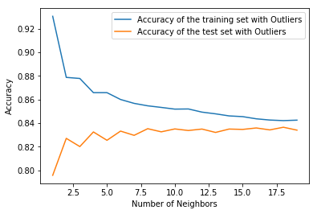
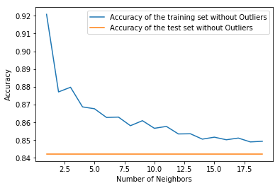

# Adult Census Income Classification
---

## Project Overview
This repository contains a comprehensive machine learning pipeline for predicting whether an individual's income exceeds $50K/year based on census data. The project explores various classification algorithms, from instance-based learning (KNN) to deep neural networks, while emphasizing the importance of rigorous data preprocessing and outlier detection.

## 🧠 Machine Learning Pipeline

### 1. Data Preprocessing & Cleaning
Real-world datasets are often noisy. The pipeline includes:
*   **Missing Value Imputation**: Handling '?' values by mapping them to numerical labels or NaN.
*   **One-Hot Encoding**: Converting categorical features (workclass, education, occupation, etc.) into binary vectors to ensure compatibility with numerical algorithms.
*   **L1 Normalization**: Scaling features to a unit norm using the L1 distance:
    $$x_{norm} = \frac{x}{\sum_{i=1}^n |x_i|}$$

### 2. Outlier Detection (Tukey's Method)
To prevent extreme values (like anomalous capital gains) from skewing the model, we use the **Interquartile Range (IQR)** method:
*   **IQR calculation**: $IQR = Q3 - Q1$
*   **Boundaries**: 
    $$Floor = Q1 - 1.5 \times IQR$$
    $$Ceiling = Q3 + 1.5 \times IQR$$
Any data point outside $[Floor, Ceiling]$ is treated as an outlier and removed to ensure model robustness.

---

## 📈 Model Performance & Visualizations

### K-Nearest Neighbors (KNN)
We analyzed the impact of the hyperparameter $K$ on classification accuracy. KNN classifies points based on the majority class of its nearest neighbors using the Euclidean distance:
$$d(p, q) = \sqrt{\sum_{i=1}^n (q_i - p_i)^2}$$

#### Accuracy vs. Number of Neighbors (K)
The plots below compare the model performance with and without outlier removal.

| With Outliers | Without Outliers |
| :---: | :---: |
|  |  |

*Observation: Outlier removal significantly stabilizes the validation accuracy across different values of K.*

---

## 🚀 Deep Learning Implementation

### Neural Network Architecture (Keras)
A Multi-Layer Perceptron (MLP) was implemented using Keras with the following components:
*   **Input Layer**: 104 encoded features.
*   **Hidden Layers**: Dense layers with ReLU activation.
*   **Output Layer**: Sigmoid activation for binary classification:
    $$\sigma(z) = \frac{1}{1 + e^{-z}}$$
*   **Early Stopping**: Implemented to monitor validation loss and prevent overfitting.

### Evaluation Metrics
We use a suite of metrics to evaluate the classification quality:
*   **Precision**: $\frac{TP}{TP + FP}$
*   **Recall**: $\frac{TP}{TP + FN}$
*   **F1-Score**: $2 \times \frac{Precision \times Recall}{Precision + Recall}$

---

## 🛠️ Requirements
*   Python 3.x
*   NumPy & Pandas
*   Scikit-Learn
*   Keras & TensorFlow
*   Matplotlib

## 📂 File Structure
*   `Adult Census Classification.ipynb`: The core research notebook.
*   `salary.csv`: The Adult Census Income dataset.
*   `results/`: Extracted visualizations and plots.

---
*Developed as part of CSC 369 2.0 Machine Learning Assignment (2018).*
